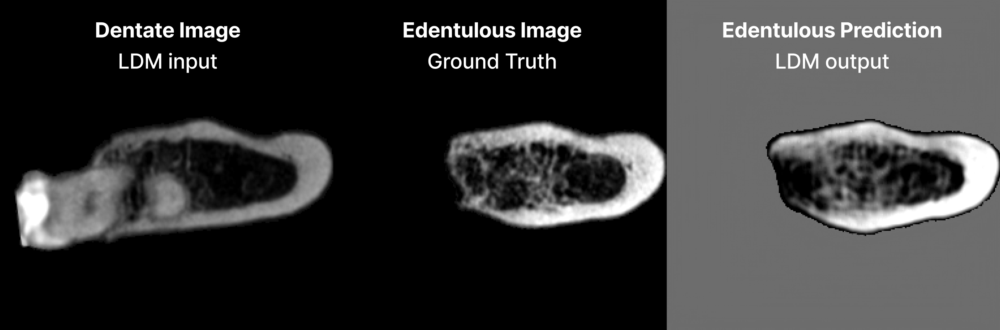

<div align="center">

# PTI-LDM-VAE

A clean, reproducible pipeline to predict **edentulous sagittal CBCT slices** from **dentate inputs** using a VAE, a regression head, and a conditioned latent diffusion model (LDM).



</div>

## Pipeline at a glance

1. **VAE** compresses each 256×256 slice into a spatial latent.
2. **Regression head** predicts edentulous geometry metrics from a dentate latent.
3. **LDM** denoises in latent space while conditioning on those metrics (and optionally dentate latents), then decodes with the VAE.

## Repository layout

```text
.
├── config/                 # JSON configs for VAE, regression head, LDM
├── data/                   # train_val/ and test/ datasets + metrics
├── docs/                   # Full documentation set
├── runs/                   # Checkpoints, outputs, metrics, caches
└── src/pti_ldm_vae_v2/     # Cleaned codebase (VAE / RegHead / LDM)
```

## Documentation

- [`docs/index.md`](docs/index.md): Doc index and quick links.
- [`docs/setup.md`](docs/setup.md): Environment setup (uv or conda) and W&B login.
- [`docs/data.md`](docs/data.md): Dataset layout and metrics file locations.
- [`docs/quickstart.md`](docs/quickstart.md): Minimal end-to-end commands.
- [`docs/configs.md`](docs/configs.md): Config structure and key fields.
- [`docs/runs.md`](docs/runs.md): Run outputs and folder structure.
- [`docs/cache.md`](docs/cache.md): Latent cache behavior.
- [`docs/wandb.md`](docs/wandb.md): Logging configuration and offline mode.
- [`docs/architecture.md`](docs/architecture.md): Detailed method description.

## Quickstart

Follow `docs/setup.md`, then:

```bash
python -m pti_ldm_vae_v2.vae.train -c config/vae_both_no_adv.json
python -m pti_ldm_vae_v2.regression_head.train -c config/nreg_edente_from_both.json
python -m pti_ldm_vae_v2.ldm.train -c config/ldm_both_no_adv_metrics_only_noisy.json
```

For sampling and metric plots, see `docs/quickstart.md`.

## Architecture

A full description lives in [`docs/architecture.md`](docs/architecture.md). In short, the VAE compresses
each 256×256 slice into a spatial latent, the regression head predicts six edentulous geometry metrics
from dentate latents, and the LDM denoises in latent space while conditioning on those metrics
(optionally also on dentate latents). The figure below shows the LDM training loop used in this project.


