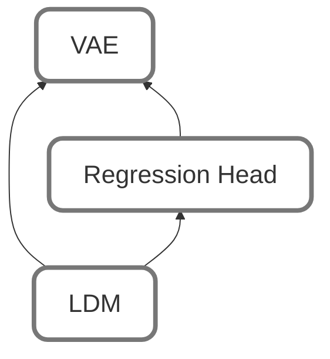

## Architecture

This repository implements a latent generative pipeline to predict **edentulous sagittal CBCT slices** from **dentate inputs**. The method is structured into three blocks:

---

### A) VAE + Regression Head (latent representation + metric inference)

We first train a **Variational Autoencoder (VAE)** to obtain a compact representation of each 256×256 sagittal slice. The encoder maps an input slice `x` to a **spatial latent tensor** `z` (4 channels at 32×32 resolution), and the decoder reconstructs the slice `x_hat`.

**VAE training objective (high-level).** The VAE is optimized with:
- a **reconstruction term** enforcing fidelity between `x` and `x_hat`,
- a **KL regularization term** encouraging the latent distribution to match a unit Gaussian prior,
- a **perceptual term** comparing deep feature representations of `x` and `x_hat` (from selected layers of a fixed feature network).

**Regression head.** In parallel, we train a **decoupled regression head** on top of a **frozen dentate encoder**. Given a dentate latent `z0*`, the regression head (Flatten + MLP) predicts six edentulous geometric metrics:

- `a_hat = [height_0, width_0, width_1, width_2, width_3, width_4]`

These predicted metrics act as **geometric constraints** that are later used to condition the diffusion model.

---

### B) LDM (partial diffusion initialization + conditioning via metrics)

We train a **Latent Diffusion Model (LDM)** operating in the latent space of the selected VAE. The LDM learns to generate an edentulous latent `z_hat0`, which is then decoded by the VAE decoder to obtain the final edentulous slice.

#### B.1 Partial diffusion initialization (why and how)

Instead of starting reverse diffusion from pure Gaussian noise, we use a **partial diffusion** initialization:

1. Encode the dentate input to get `z0*`.
2. Apply forward diffusion up to a timestep `t`, injecting noise **non-uniformly** with a **vertical gradient mask**:
   - low noise in the basal region (to preserve patient identity),
   - higher noise towards the ridge/crest region (to allow remodeling variability).
3. Run the reverse denoising process to obtain `z_hat0`.

This design encourages the model to modify primarily the high-noise ridge region while keeping low-noise basal structures consistent.

#### B.2 Conditioning mechanism (CondEnc + cross-attention)

To guide denoising toward patient-specific geometry, the U-Net denoiser is conditioned on the six metrics `a_hat`:

- a **Conditioning Encoder (CondEnc)** transforms the 6D metrics vector into a higher-dimensional embedding,
- this embedding is injected into the U-Net via **cross-attention**, steering generation toward the target geometry while preserving realistic anatomical variability.

**LDM training objective (high-level).** The diffusion model is trained with the standard diffusion objective: the network learns to predict the injected noise given the noised latent, the conditioning metrics, and the diffusion timestep. The learnable parameters include **both** the U-Net and CondEnc.

---

### C) Inputs / Outputs and what is frozen vs. trained

This section clarifies what flows through the pipeline and what is optimized at each stage.

#### C.1 Inputs and outputs

**Inputs**
- **Dentate image** `x*` (256×256)
- **Training only:** edentulous target image `x_ed`
- **Training only:** ground-truth metrics `a` (6 values) extracted from the edentulous mask
- **Inference / LDM stage:** predicted metrics `a_hat` produced by the regression head

**Outputs**
- **VAE reconstruction** `x_hat`
- **Predicted metrics** `a_hat`
- **Predicted edentulous latent** `z_hat0`
- **Predicted edentulous image** obtained by decoding `z_hat0` with the VAE decoder

#### C.2 What is trained vs. frozen (by stage)

**Stage 1 — Train the VAE**
- **Trained:** VAE encoder + decoder (end-to-end)

**Stage 2 — Train the regression head**
- **Frozen:** VAE dentate encoder (used to produce `z0*`)
- **Trained:** regression head (Flatten + MLP) to predict `a_hat`

**Stage 3 — Train the LDM**
- **Frozen:** VAE encoder + decoder (latent space is fixed once the VAE is selected)
- **Typically frozen:** regression head (used only to provide `a_hat` conditioning)
- **Trained:** U-Net denoiser + CondEnc (diffusion training)

---

### D) Selected models (configs used in this repo)

The final experiments and main pipeline are driven by the following configuration files:

- **VAE (latent space backbone):** `vae_both_no_adv.json`
- **Regression head (metrics prediction):** `nreg_edente_from_both.json`
- **LDM (partial diffusion + metrics conditioning):** `ldm_both_no_adv_metrics_only_noisy.json`

